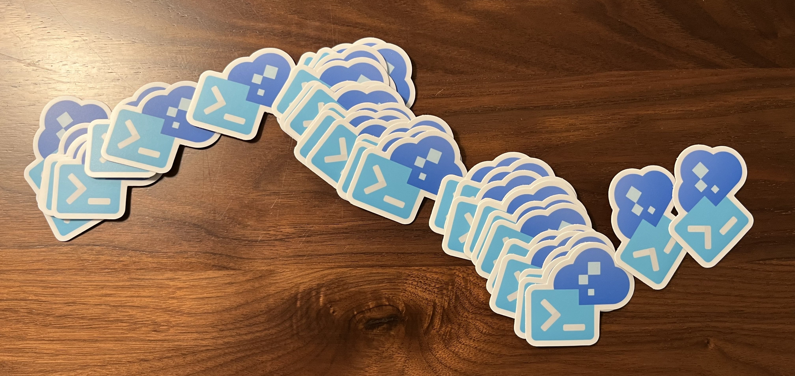

# **Hey there👋! I'm Savannah!** 

## **A bit about me...**
- 🛠 Developer experience + tooling @ [Microsoft](https://github.com/microsoft)/[Azure](https://github.com/azure/)
- 📦 Building the [Azure Developer CLI (`azd`)](https://github.com/azure/azure-dev)
- ✨ Previously worked on [Pylance](https://github.com/microsoft/pylance-release) and [Python in VS Code](https://github.com/microsoft/vscode-python)
- 🐈 Cat mom to [Nori, Miso](https://twitter.com/savostrowski/status/1559183067792650243) + [Momo](https://twitter.com/savostrowski/status/1572073421164650496)
- 💖 Python, Go, containers, DevOps, cats

## **Upcoming conferences/talks**
- Microsoft Build (May 23-24) - [all sessions](https://build.microsoft.com/en-US/sessions?search=savannah+ostrowski)
  - [Python web apps on Microsoft Azure, Q&A](https://build.microsoft.com/en-US/sessions/15974ac4-9aae-4bb2-9430-1bf42fb47d2d?source=sessions)
  - [Codespaces to Azure in minutes with the Azure Developer CLI](https://build.microsoft.com/en-US/sessions/f71571ba-8dcc-4707-bc9f-f0c66b388bec?source=sessions)
  - [Build a serverless web application end-to-end on Microsoft Azure](https://build.microsoft.com/en-US/sessions/f249ceaa-aa9d-473a-891d-d0dca6cb4191?source=sessions)
- Visual Studio Live! (July 20) - [Why you need the Azure Developer CLI in your life](http://www2.vslive.com/Events/MicrosoftHQ-2023/Sessions/Thursday/VH13-Fast-Focus-Why-you-need-the-Azure-Dev-CLI.aspx)

## Dev tools that I'm really digging right now
- CLI libraries
  - [Typer](https://github.com/tiangolo/typer)
  - [Rich](https://github.com/textualize/rich)
  - [Basically everything Charm makes](https://github.com/charmbracelet)
- Editor tooling
  - [GitHub Actions extension for Visual Studio Code](https://marketplace.visualstudio.com/items?itemName=GitHub.vscode-github-actions)
  - [Codespaces](https://github.com/codespaces)
- Miscellaneous
  - [GoReleaser](https://github.com/goreleaser/goreleaser)
  - [Poetry](https://github.com/python-poetry/poetry)
 
 
 

 

